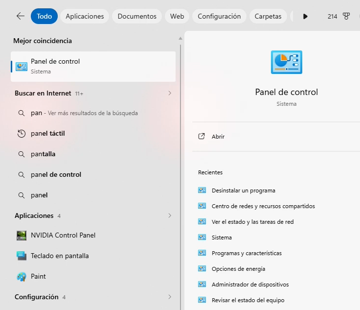
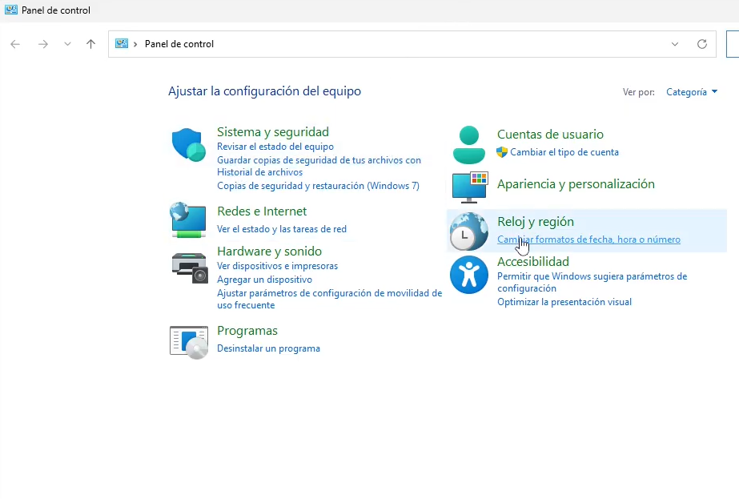
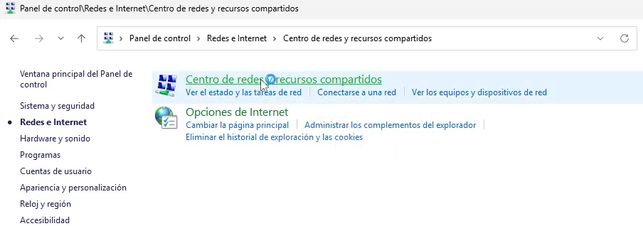
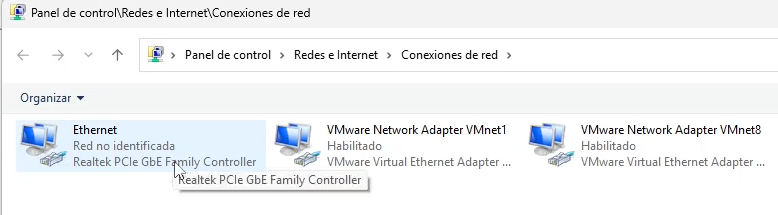
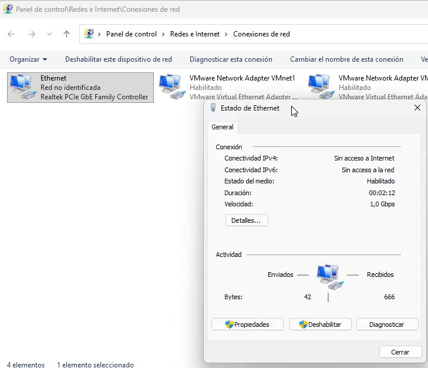
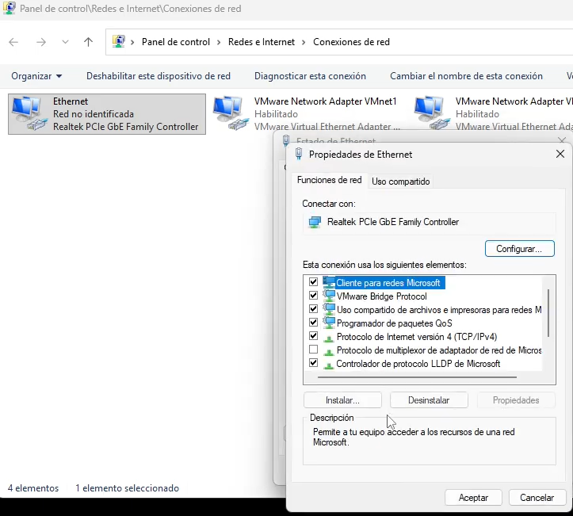
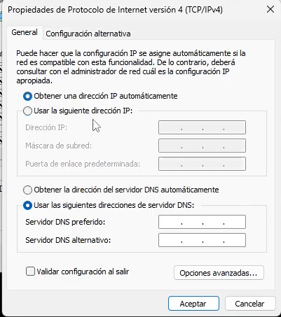
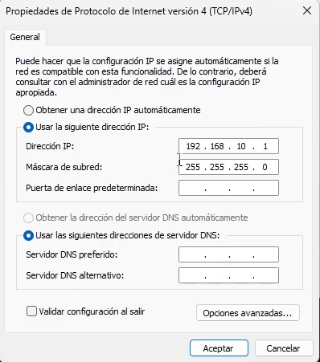

# Guía: Conexión a Raspberry Pi mediante NoMachine


**Autor:** Johan Alejandro López Arias ([@ElJoho](https://github.com/ElJoho))


<details>
  <summary>
    <b>Video tutorial</b> — <a href="https://www.youtube.com/watch?v=30KEEl1uhBM">Como conectarse a las raspberry pi usando NoMachine</a>
  </summary>
</details>
<br>

Esta guía explica cómo conectarse desde un computador con Windows a la Raspberry Pi del kit del PhantomX Pincher usando **NoMachine**, configurar la red Ethernet, y realizar las primeras operaciones básicas en el workspace de ROS 2.

---

## Requisitos previos

- Computador con Windows.
- Raspberry Pi del kit, energizada.
- Cable Ethernet.
- Si tu computador no tiene puerto Ethernet, necesitarás un **adaptador USB → Ethernet**.

---

## 1. Instalar NoMachine

1. Buscar **NoMachine** en el navegador y entrar a la página oficial.
2. Descargar la versión para Windows (puedes guardarla en el escritorio).
3. Ejecutar el instalador y seguir el asistente: **Siguiente → Siguiente → Siguiente**.
4. La instalación es rápida.
5. Al finalizar, **reiniciar el computador** (es obligatorio).

---

## 2. Conectar la Raspberry Pi físicamente

1. Energizar la Raspberry Pi del kit.
2. Conectarla por **cable Ethernet directamente al computador**.
3. No es necesario configurar nada adicional en la Raspberry; basta con energizarla y conectarla por cable.

---

## 3. Configurar el adaptador de red en Windows

La Raspberry Pi tiene asignada la IP estática **`192.168.10.2`**. Para que el computador la pueda alcanzar, debes asignarle al adaptador Ethernet del PC la IP **`192.168.10.1`**, en la misma subred.

### 3.1 Abrir el Panel de control

Buscar *"Panel de control"* en el menú de inicio de Windows.



### 3.2 Ir a Redes e Internet

En el Panel de control, hacer clic en **Redes e Internet**.



### 3.3 Centro de redes y recursos compartidos

Clic en **Centro de redes y recursos compartidos**.



### 3.4 Cambiar configuración del adaptador

En el panel lateral izquierdo, clic en **Cambiar configuración del adaptador**. Aparecerá la conexión Ethernet (probablemente como *"Red no identificada"*):



### 3.5 Abrir propiedades del adaptador

Doble clic sobre la conexión Ethernet. Se abrirá la ventana **Estado de Ethernet** → clic en **Propiedades**.



### 3.6 Seleccionar IPv4

En la lista, seleccionar **Protocolo de Internet versión 4 (TCP/IPv4)** y clic en **Propiedades**.



### 3.7 Configurar IP estática

Por defecto el adaptador estará configurado para obtener IP automáticamente:



Cambiar a **Usar la siguiente dirección IP** y configurar:

| Campo | Valor |
|-------|-------|
| Dirección IP | `192.168.10.1` |
| Máscara de subred | `255.255.255.0` |
| Puerta de enlace predeterminada | *(vacío)* |



> **Nota:** Si al abrir esta ventana los campos aparecen grises o con valores antiguos cargados, hacer clic en el campo **Dirección IP** y volver a escribir `192.168.10.1` para activarlos.

Aceptar todas las ventanas y cerrar el Panel de control.

---

## 4. Conexión inicial con NoMachine

1. Abrir NoMachine. La primera vez aparece un mensaje de bienvenida → clic en **OK**.
2. Debe aparecer automáticamente la Raspberry Pi en la lista, identificada como **Ubuntu 24.04 LTS**.
3. Clic sobre ella e ingresar las credenciales:

   - **Usuario:** `unpi`
   - **Contraseña:** `unpi`

4. Marcar la opción **Guardar credenciales**, dar **OK** y se abrirá el escritorio remoto de la Raspberry Pi.

---
 
> [!NOTE]
> **Hasta aquí termina lo necesario para conectarse por NoMachine.**
>
> Las secciones siguientes son contenido complementario sobre uso básico de la Raspberry y ROS 2 una vez ya estás conectado.

---

## 5. Uso básico de la terminal

### 5.1 Navegar al workspace

```bash
ls
cd ros2
ls
```

### 5.2 Autocompletar nombres

- En lugar de escribir el nombre completo de un archivo o carpeta, escribir las primeras letras y presionar **Tab** para autocompletar.
- Si hay varias coincidencias, presionar **Tab dos veces** para listar opciones, escribir la siguiente letra y volver a Tab.

### 5.3 Mayúsculas

> **Importante:** El **Bloq Mayús (Caps Lock)** está **deshabilitado** en la Raspberry para evitar problemas de sincronización con el computador local.
>
> Para escribir mayúsculas, usar **Shift + letra**.

### 5.4 Limpiar la pantalla

```bash
clear
```

### 5.5 Múltiples paneles con Terminator

La Raspberry trae instalado **Terminator** como emulador de terminal, que permite abrir múltiples paneles dentro de una misma ventana. Esto es muy útil para trabajar con ROS 2.

---

## 6. Actualizar el repositorio

Cada vez que abras la carpeta del workspace, ejecutar:

```bash
git pull origin main
```

Esto asegura que tengas la versión más reciente del código.

---

## 7. Compilar el workspace (colcon)

El workspace de ROS 2 se llama **`Phantom_WS`** (PhantomX Pincher Workspace).

```bash
cd Phantom_WS
```

### 7.1 Compilación normal (8 GB+ de RAM)

```bash
colcon build
```

### 7.2 Compilación con RAM limitada (4 GB)

Si tu Raspberry Pi tiene poca RAM (por ejemplo 4 GB), un `colcon build` normal puede consumirla toda y forzar un reinicio. Para evitarlo, limitar el número de núcleos usados durante la compilación:

```bash
MAKEFLAGS="-j2" colcon build --parallel-workers 1
```

Esto le indica al compilador que use solo 2 núcleos (puedes bajarlo a `-j1` si sigue siendo demasiado pesado), reduciendo el consumo de RAM.

> **Tip:** El primer `colcon build` es el más demandante. Las compilaciones posteriores son mucho más rápidas y livianas, ya que `colcon` solo reconstruye lo que cambió.

### 7.3 Recomendaciones generales

- Usa un computador con al menos **8 GB de RAM**, preferiblemente 16 GB.
- Si vas a trabajar con Linux desde tu PC, **usa particiones reales en disco**, no máquinas virtuales — son un dolor de cabeza para ROS.

---

## 8. Apagar la Raspberry Pi correctamente

Antes de desenergizarla:

1. En el escritorio remoto, clic en el menú de usuario (esquina superior derecha) → **Power** → **Apagar**.
2. Esperar a que la sesión se cierre por completo.
3. Recién entonces puedes desenergizar la Raspberry Pi.

> **Nunca** desconectes la alimentación sin apagar primero: corres riesgo de corromper la tarjeta SD.

---

## Estructura del workspace

Dentro de `~/ros2/` encontrarás:

- **`guias/`** — guías de uso del workspace.
- **`Phantom_WS/`** — el workspace de ROS 2 con los paquetes del PhantomX Pincher.

---

## Próximos tutoriales

- **Uso de GitHub** — esencial para no perder horas (o días) de trabajo por errores de versionado.
- **Movimiento del robot** y los distintos modos disponibles.
- **VS Code Remote-SSH** para editar archivos de la Raspberry desde tu computador.
- Contenido del kit, armado y almacenamiento del robot.
- Movimiento del robot en simulación (**RViz**) y en físico.

> **Sobre IDEs en remoto:** Editar con VS Code Remote-SSH es más liviano que mantener dos escritorios abiertos en paralelo (NoMachine + tu PC). La Raspberry sigue haciendo todo el trabajo pesado, pero la interfaz vive en tu computador. También puedes instalar IDEs alternativos como Sublime Text en la Raspberry, pero VS Code suele ser la mejor opción para ROS.

---

## Resumen rápido

| Acción | Comando / Valor |
|--------|----------------|
| IP de la Raspberry Pi | `192.168.10.2` |
| IP del PC (adaptador Ethernet) | `192.168.10.1` |
| Máscara de subred | `255.255.255.0` |
| Usuario / contraseña | `pi` / `pi` |
| OS de la Raspberry | Ubuntu 24.04 LTS |
| Actualizar repo | `git pull origin main` |
| Build normal | `colcon build` |
| Build con RAM limitada | `MAKEFLAGS="-j2" colcon build --parallel-workers 1` |
| Mayúsculas | **Shift + letra** (Caps Lock deshabilitado) |
