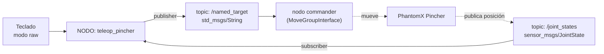

# Práctica de Laboratorio 1: Control del PhantomX Pincher por Teclado

**Autor:** Johan Alejandro López Arias ([@ElJoho](https://github.com/ElJoho))

**Video explicativo:** [UNAL Phantom X Pincher: Laboratorio propuesto 1](https://www.youtube.com/watch?v=38wkKE58Vzo)

---

## Objetivos

Al finalizar esta práctica el estudiante será capaz de:

1. Definir **4 poses** del **PhantomX Pincher** y comandarlas vía `/named_target`.
2. Implementar un **único nodo** ROS2 (`teleop_pincher`) que sea simultáneamente:
   - **Subscriber** de `/joint_states` (para saber cuándo el robot terminó de moverse).
   - **Publisher** de `/named_target` (para enviar al robot a una pose por nombre).
3. Leer **teclas inmediatas** desde el terminal en modo *raw*.
4. Modificar `kit.xacro` y `phantomx_pincher_arm.xacro` para identificar visualmente el robot y al equipo de trabajo.

---

## Requisitos previos

- ROS2 (Humble o superior) y MoveIt2.
- Repositorio clonado y compilado: [`labsir-un/KIT_Phantom_X_Pincher_ROS2`](https://github.com/labsir-un/KIT_Phantom_X_Pincher_ROS2)
- Haber visto el video explicativo enlazado arriba.
- Haber leído las guías:
  - [`ros2_basics_part1_publisher_and_subscriber.md`](../../guias/ROS2_basics/ros2_basics_part1_publisher_and_subscriber.md) — publisher y subscriber básicos.
  - [`ros2_basics_part2_moving_the_robot.md`](../../guias/ROS2_basics/ros2_basics_part2_moving_the_robot.md) — lectura de teclas, detección de movimiento y publicación a `/named_target`. **Las tres piezas que se combinan en este lab.**
  - [`MOTION_COMMANDS.md`](../../guias/Moveit/MOTION_COMMANDS.md) — referencia de poses, topics y comandos.
  - [`addingXacroElements.md`](../../guias/URDF/addingXacroElements.md) — cómo añadir links y joints al xacro.

---

## Parte 1 — Nodo `teleop_pincher` (Publisher + Subscriber + teclado)

### 1.1 Definir 4 poses del robot

Las poses se referencian por su **nombre en el SRDF** y se publican como `std_msgs/String` en `/named_target`. El `commander` se encarga del resto.

Cada grupo elige **4 poses** y las asigna a las teclas `a`, `b`, `c` y `d` (más `q` para salir). Las opciones son:

- **Usar poses existentes** del SRDF (`up`, `rest`, `ready_near`, `ready_mid`, `ready_far`, `overRightNearCan`). Los valores articulares y la descripción de cada una están en `MOTION_COMMANDS.md` §7.1.
- **Crear poses propias** añadiendo bloques `group_state` al archivo `phantomx_pincher_moveit_config/srdf/phantomx_pincher.srdf`. Si optan por esta vía, recuerden volver a compilar el workspace para que MoveIt cargue el nuevo SRDF.

### 1.2 Probar las poses manualmente

Antes de programar nada, verifique que sus 4 poses se alcanzan publicando manualmente en `/named_target`. La sintaxis exacta y los comandos están en `MOTION_COMMANDS.md` §7.3.

### 1.3 Arquitectura del nodo

El nodo `teleop_pincher` combina los **tres comportamientos** explicados por separado en `ros2_basics_part2_moving_the_robot.md`:

- **Capítulo 5** — lectura inmediata de teclas con `termios`/`tty`.
- **Capítulo 6** — suscripción a `/joint_states` para detectar cuándo el robot dejó de moverse.
- **Capítulo 7** — publicación a `/named_target`.

Flujo de datos del lab:



La idea del lazo es:

1. El usuario presiona `a`, `b`, `c` o `d`.
2. El nodo publica el nombre de la pose en `/named_target`.
3. El `commander` recibe el nombre, MoveIt planifica y ejecuta.
4. `/joint_states` refleja el movimiento en tiempo real.
5. El subscriber detecta cuándo el robot se detiene; mientras esté en movimiento, las teclas se **ignoran** para no sobrecargarlo.

> `/named_target` no lo van a publicar ustedes desde la terminal cuando el nodo esté corriendo: lo publica el propio `teleop_pincher` en respuesta a las teclas.

### 1.4 Estructura del nodo

El paquete `pincher_control` ya existe en el repo, así que el script nuevo (`teleop_pincher.py`) va dentro de `pincher_control/pincher_control/`. Recuerden registrar el `entry_point` correspondiente en `setup.py` (ver guía Parte 1 §5).

A continuación una **estructura sugerida** del nodo en pseudocódigo. La implementación es responsabilidad del grupo:

```
CONSTANTES (al inicio del archivo):
    TECLAS              = {'a': pose1, 'b': pose2, 'c': pose3, 'd': pose4}
    UMBRAL_MOVIMIENTO   # delta mínimo entre lecturas para considerar movimiento
    LECTURAS_ESTABLES   # frames consecutivos quietos para confirmar la detención


CLASE TeleopPincher(Node):

    ATRIBUTOS:
        publisher  → /named_target            (std_msgs/String)
        subscriber → /joint_states            (sensor_msgs/JointState)
        ocupado    → señal hilo-seguro        (True = robot moviéndose, ignorar teclas)
        lock       → mutex para el estado compartido entre el callback y el teclado
        ultimas_pos             (lista de posiciones de la última lectura)
        robot_moviendose        (True solo después de detectar que el robot arrancó)
        lecturas_estables       (contador de lecturas consecutivas sin movimiento)

    MÉTODO publicar(nombre_pose):
        reiniciar contadores y bandera de movimiento
        marcar `ocupado`
        publicar `nombre_pose` en /named_target

    CALLBACK _cb_joint_states(msg):
        SI NO `ocupado`:
            solo actualizar `ultimas_pos` como referencia → retornar
            (no se detecta nada hasta que se publique una pose nueva)

        # Ya hay un comando en curso: detectar arranque y luego detención
        delta = max(|pos_actual - pos_anterior|) joint por joint
        actualizar `ultimas_pos`

        SI delta > UMBRAL_MOVIMIENTO:
            robot_moviendose = True
            lecturas_estables = 0
        SINO SI robot_moviendose:
            lecturas_estables += 1
            SI lecturas_estables >= LECTURAS_ESTABLES:
                liberar `ocupado`  → aceptar nuevas teclas


FUNCIÓN leer_teclado(node):
    guardar configuración original del terminal
    poner terminal en modo raw
    TRY:
        LOOP:
            leer 1 tecla
            SI tecla == 'q':    shutdown y salir
            SI `ocupado`:       avisar e ignorar tecla
            SI tecla en TECLAS: node.publicar(TECLAS[tecla])
            SI NO:              avisar tecla desconocida
    FINALLY:
        restaurar configuración original del terminal   ← obligatorio


FUNCIÓN main():
    rclpy.init
    crear nodo
    lanzar `rclpy.spin` EN UN HILO APARTE   (daemon)
    correr `leer_teclado` en el hilo principal
    al salir: destruir nodo y rclpy.shutdown
```

**Justificación de las decisiones de diseño** (pensar antes de empezar a codificar):

- **`rclpy.spin` en un hilo aparte.** La lectura de teclas es bloqueante: `sys.stdin.read(1)` se queda parado hasta que llega una tecla. Si esto corre en el mismo hilo que `spin`, los callbacks de `/joint_states` no se ejecutan mientras se espera, y el nodo no se entera de cuándo el robot terminó de moverse.
- **Señal `ocupado` entre hilos.** El estado "robot moviéndose / robot libre" lo escribe el callback de `/joint_states` (hilo de `spin`) y lo lee el loop de teclado (hilo principal). Una primitiva diseñada para esto, como un `threading.Event`, es más limpia y segura que un `bool` desnudo.
- **Mutex (`lock`) sobre el estado compartido.** Las variables `ultimas_pos`, `robot_moviendose` y `lecturas_estables` también se tocan desde los dos hilos. El lock evita condiciones de carrera al leerlas/escribirlas.
- **Dos fases en la detección de movimiento.** Cuando se publica una pose nueva, el robot todavía no ha empezado a moverse. Si solo contáramos lecturas estables, el nodo creería que el robot ya terminó (porque sigue en la pose anterior). Por eso primero se detecta el **arranque** (`delta > UMBRAL`) y solo después se cuenta la **estabilización**.
- **Restaurar el terminal en `finally`.** Si el programa se cae con el terminal en modo raw, queda inutilizable. El `finally` garantiza que se restaura pase lo que pase.

### 1.5 Ejecutar y verificar

Lanzar el stack completo (terminal 1) y el nodo (terminal 2). El comando de lanzamiento está en `MOTION_COMMANDS.md` §2.

Para confirmar que el nodo cumple ambos roles, abran `rqt_graph` mientras está corriendo y verifiquen que aparece el mismo flujo del mermaid:

```
/joint_states ──► teleop_pincher ──► /named_target
```

---

## Parte 2 — URDF/XACRO: Personalizar el robot

El objetivo es modificar los xacro para que cada robot quede identificado visualmente con su número y los nombres del equipo. El procedimiento general (link + joint, escala, ejes, etc.) está en `addingXacroElements.md`.

Diferencia importante respecto a esa guía: **estos elementos NO llevan tag `<collision>`**, porque son puramente visuales y el robot no debería chocar contra ellos.

### 2.1 Archivos `.dae` provistos

En el repositorio, dentro de `laboratorios_propuestos/laboratorio_1/dae/`, ya están preparados:

| Archivo                       | Uso                                                                  |
|-------------------------------|----------------------------------------------------------------------|
| `numero1.dae` … `numero7.dae` | Placa con el número del robot. Va en la **base** y en la **bomba de vacío**. |
| `pxp1.dae` … `pxp7.dae`       | Identificador del robot (PXP + número). Va en la **canastilla**.     |

Para revisar los archivos disponibles:

```bash
cd ~/<ruta-del-repo>/laboratorios_propuestos/laboratorio_1/dae
ls
```

### 2.2 Cambios requeridos

Su grupo debe añadir al xacro:

1. **Número del robot en la base** (`numeroN.dae`) → modificar `kit.xacro`.
2. **Número del robot en la bomba de vacío** (`numeroN.dae`) → modificar `phantomx_pincher_arm.xacro`.
3. **4 identificadores `pxpN` en la canastilla**, uno por cada lado (`pxpN.dae`) → modificar `kit.xacro`. Como la canastilla es rectangular tiene 4 lados, así que se colocan 4 placas idénticas, una en cada cara.
4. **4 placas con los nombres del equipo** en la canastilla, una por cada lado → modificar `kit.xacro`. El `.dae` lo crea el grupo de cero (Inventor → Blender 4.2 LTS → DAE, ver Ep. 6 de la serie de URDF) y se instancia 4 veces, una por cara.

> Las 4 placas `pxpN` son el mismo archivo `.dae` referenciado desde 4 links distintos con sus respectivos joints (mismo padre `canastilla_link`, distintas traslaciones y rotaciones). Lo mismo aplica para las 4 placas de nombres. No es necesario duplicar el archivo `.dae`.

### 2.3 Procedimiento

Para cada elemento siguen el procedimiento de `addingXacroElements.md` (sección "Para elementos con un solo tag visual…"), **omitiendo los pasos relacionados con colisiones**:

- En `kit.xacro` se usan links y joints simples, sin prefijo.
- En `phantomx_pincher_arm.xacro` todos los nombres llevan `${prefix}` por delante (ver plantilla con `${prefix}` e `inertial` en la guía, omitiendo el bloque `<collision>` y el `<inertial>` para estos elementos puramente decorativos).

### 2.4 Visualizar en RViz

Comando de lanzamiento en `MOTION_COMMANDS.md` §2. Verificar que se ven todas las placas: número en la base, número en la suction cup, 4× `pxpN` (una por cada lado de la canastilla) y 4× placas de nombres del equipo (una por cada lado).

---

## Entregables

1. **Repositorio o carpeta comprimida** con:
   - El script `teleop_pincher.py` dentro de `pincher_control` y su entry_point registrado.
   - `kit.xacro` y `phantomx_pincher_arm.xacro` modificados.
   - El `.dae` con los nombres del equipo.
2. **Video corto (1–2 min)** mostrando:
   - El nodo `teleop_pincher` moviendo el **robot real** a las 4 poses con `a/b/c/d`.
   - Que las teclas repetidas se ignoran mientras el robot se está moviendo.
   - RViz con todas las placas visibles (base, suction cup, 4× `pxpN` y 4× nombres del equipo en la canastilla).
   - Captura de `rqt_graph` con el flujo `/joint_states → teleop_pincher → /named_target`.
3. **Informe breve** (máximo 3 páginas):
   - Descripción de las 4 poses elegidas y por qué (indicar si las crearon en el SRDF).
   - Capturas del nodo funcionando y de RViz.
   - Dificultades encontradas y cómo se resolvieron.

---

## Rúbrica de evaluación

| Criterio                                                                          | Peso |
|-----------------------------------------------------------------------------------|------|
| Las 4 poses funcionan correctamente al presionar `a/b/c/d`                        | 25%  |
| El nodo es a la vez publisher y subscriber, evidenciado en `rqt_graph`            | 20%  |
| El nodo ignora teclas mientras el robot se está moviendo                          | 10%  |
| Número del robot en la base y en la bomba de vacío                                | 20%  |
| Identificación de la canastilla (4× `pxpN` + 4× nombres del equipo)               | 10%  |
| Calidad del informe y del video                                                   | 15%  |
